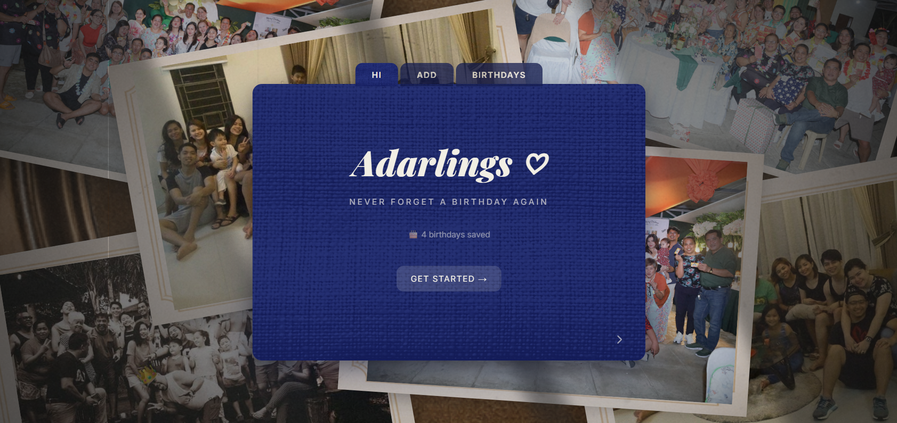

# Birthday Reminder

Birthday Reminder is a simple web app that helps you keep track of important birthdays so you never miss a celebration again. Add names and birthdates, and the app will automatically show upcoming birthdays sorted by the soonest date.

Visit the site live at: https://adarlings-bday-reminders.vercel.app/



##  Features
- Add a person's **name and birthday**
- View a list of **upcoming birthdays**
- Automatically **sorted by the soonest birthday**
- Shows **days remaining**
- Delete birthdays from the list
- Data saved using **localStorage**
- Create shared **photo albums**
- Upload photos that are visible to anyone with the website link

## Built With
- React
- Vite
- Tailwind CSS
- LocalStorage
- Supabase (Database + Storage)

## Shared Albums Setup (Supabase)

The Albums tab uses Supabase so data is shared across all users.

1. Create a Supabase project.
2. In SQL Editor, run:

```sql
create table if not exists public.albums (
	id uuid primary key default gen_random_uuid(),
	name text not null,
	description text,
	created_at timestamptz not null default now()
);

create table if not exists public.photos (
	id uuid primary key default gen_random_uuid(),
	album_id uuid not null references public.albums(id) on delete cascade,
	caption text,
	file_path text not null,
	public_url text not null,
	created_at timestamptz not null default now()
);

alter table public.albums enable row level security;
alter table public.photos enable row level security;

drop policy if exists "public read albums" on public.albums;
create policy "public read albums" on public.albums
for select to anon using (true);

drop policy if exists "public insert albums" on public.albums;
create policy "public insert albums" on public.albums
for insert to anon with check (true);

drop policy if exists "public delete albums" on public.albums;
create policy "public delete albums" on public.albums
for delete to anon using (true);

drop policy if exists "public read photos" on public.photos;
create policy "public read photos" on public.photos
for select to anon using (true);

drop policy if exists "public insert photos" on public.photos;
create policy "public insert photos" on public.photos
for insert to anon with check (true);

drop policy if exists "public delete photos" on public.photos;
create policy "public delete photos" on public.photos
for delete to anon using (true);
```

3. Create a public Storage bucket named `album-photos`.
4. Add these env vars to a `.env` file:

```bash
VITE_SUPABASE_URL=your_supabase_project_url
VITE_SUPABASE_ANON_KEY=your_supabase_anon_key
```

5. Add Storage policies for bucket `album-photos` so `anon` can read and upload:

```sql
insert into storage.buckets (id, name, public)
values ('album-photos', 'album-photos', true)
on conflict (id) do update set public = true;

drop policy if exists "public read album files" on storage.objects;
create policy "public read album files" on storage.objects
for select to anon
using (bucket_id = 'album-photos');

drop policy if exists "public upload album files" on storage.objects;
create policy "public upload album files" on storage.objects
for insert to anon
with check (bucket_id = 'album-photos');

drop policy if exists "public delete album files" on storage.objects;
create policy "public delete album files" on storage.objects
for delete to anon
using (bucket_id = 'album-photos');
```

## Run the Project

```bash
npm install
npm run dev
```

---
Developed by Richelle Adarlo <3